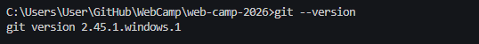
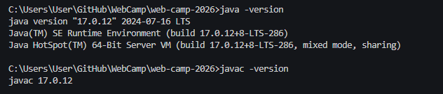
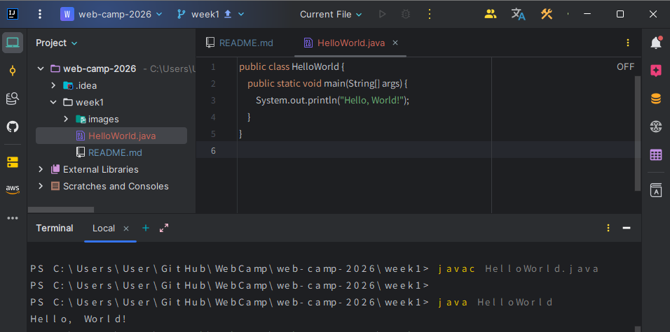
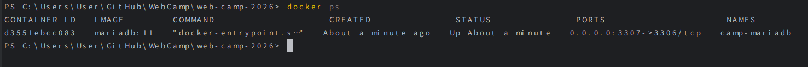
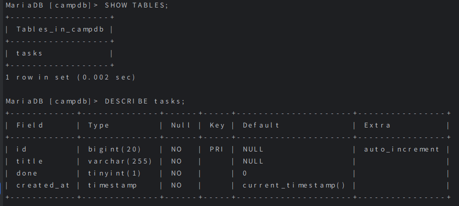
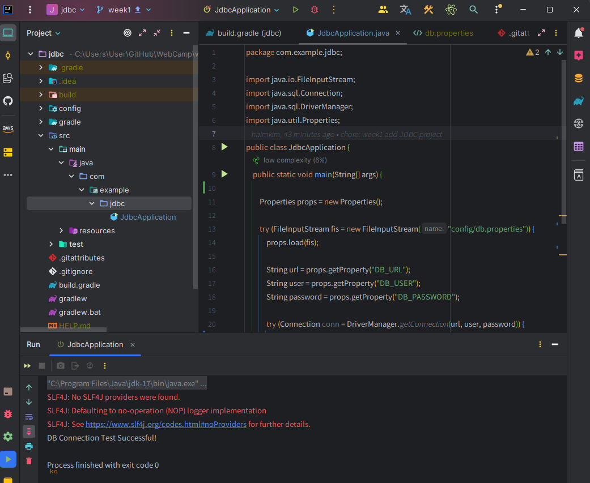

## 1주차 목표/진행상황

### **A. 기본 준비**

Git 설치 확인 (git --version)

 

첫 커밋/푸시 완료

 

---

### **B. Java / IntelliJ 준비**

B1. Java 설치

 

B2. IntelliJ 설치 및 프로젝트 생성

 

---

### **C. MariaDB를 Docker로 설치**

C1. Docker 설치 및 확인

 

C2. MariaDB 컨테이너 실행 (단일 docker run)

 

C3. DB 접속 확인

 

---

### **D. Java CRUD 프로그램(Mariadb)**

D1. JDBC 드라이버 설정 + D2. 환경변수/설정 분리

 
