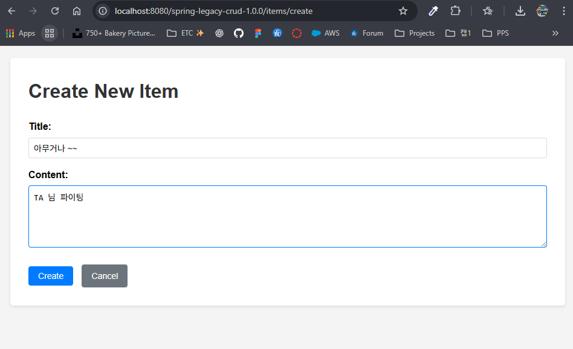
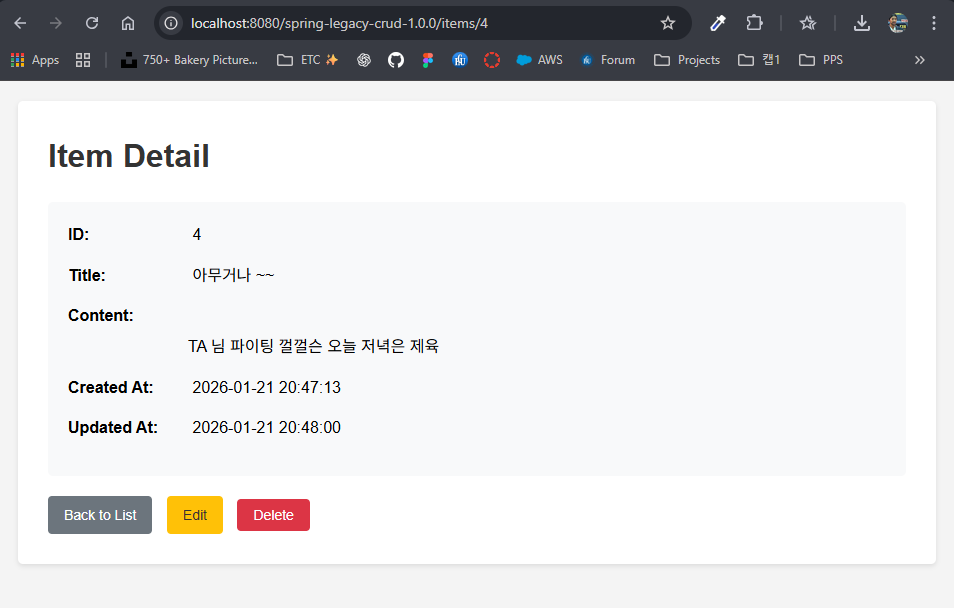
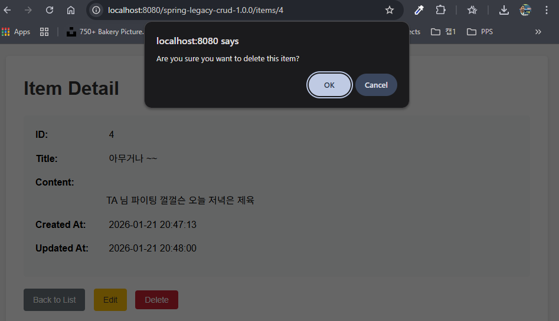

## 2주차 Spring Legacy CRUD 프로젝트

### 1. 프로젝트 개요
- **기술 스택**: Spring MVC (XML 설정), MyBatis, MariaDB, JSP, Tomcat 9  
- **프로젝트 경로**: `week2/project`  
- **WAR 이름**: `spring-legacy-crud-1.0.0.war`  

---

### 2. 실행 환경 준비
- **JDK**: 8 이상 설치 및 `java -version` 확인  
- **Maven**: 설치 및 `mvn -version` 확인  
- **MariaDB**: 실행 중이어야 함 (`spring_crud` DB 사용)  
- **Tomcat 9**: `C:\Users\User\apache-tomcat-9.0.107`  

#### 2-1. 데이터베이스 생성
MariaDB 접속:

```sql
CREATE DATABASE IF NOT EXISTS spring_crud
  CHARACTER SET utf8mb4
  COLLATE utf8mb4_unicode_ci;

USE spring_crud;

CREATE TABLE IF NOT EXISTS item (
    id INT AUTO_INCREMENT PRIMARY KEY,
    title VARCHAR(100) NOT NULL,
    content TEXT,
    created_at TIMESTAMP DEFAULT CURRENT_TIMESTAMP,
    updated_at TIMESTAMP DEFAULT CURRENT_TIMESTAMP
        ON UPDATE CURRENT_TIMESTAMP
) ENGINE=InnoDB DEFAULT CHARSET=utf8mb4;

INSERT INTO item (title, content) VALUES
('아무거나', 'This is the first item content'),
('이', '것은 그냥 아무거나 적는중'),
('상', '겹살먹고싶다');
```

`root-context.xml` 안의 DB 계정/비밀번호가 실제 MariaDB 설정과 일치해야 한다.  

---

### 3. 빌드 & 배포

#### 3-1. Maven 빌드
프로젝트 루트에서:

```bash
cd week2/project
mvn clean package
```

성공 시 `target/spring-legacy-crud-1.0.0.war` 생성.  

#### 3-2. WAR 파일 Tomcat에 복사
PowerShell에서:

```powershell
cd "C:\Users\User\GitHub\WebCamp\web-camp-2026\week2\project"
Copy-Item -Force .\target\spring-legacy-crud-1.0.0.war "C:\Users\User\apache-tomcat-9.0.107\webapps\"
```

#### 3-3. Tomcat 실행

```powershell
cd "C:\Users\User\apache-tomcat-9.0.107\bin"
.\startup.bat
```

브라우저에서 다음 주소 접속:

```text
http://localhost:8080/spring-legacy-crud-1.0.0/items
```

---

### 4. CRUD 화면 설명

#### 4-1. Read (목록 조회)
- URL: `/items`  
- 기능: 전체 게시글 리스트 조회  
- 화면 예시:

<br>

---

#### 4-2. Create (등록)
- 목록 화면에서 **Create New Item** 버튼 클릭 → `/items/create`  
- 제목/내용 입력 후 **Create** 버튼 클릭 → DB에 새 row 저장 → `/items`로 리다이렉트  
- 화면 예시:

<br>

---

#### 4-3. Update (수정)
- 목록 또는 상세 화면에서 **Edit** 버튼 클릭 → `/items/{id}/update`  
- 제목/내용 수정 후 **Update** 버튼 클릭 → 해당 row 수정 → 상세 페이지로 이동  
- 화면 예시:

<br>

---

#### 4-4. Delete (삭제)
- 목록 화면에서 **Delete** 버튼 클릭 → confirm 창에서 확인 선택 시 `/items/{id}/delete` POST 요청  
- 해당 row 삭제 후 `/items`로 리다이렉트  
- 화면 예시:

<br>
<br>

---

### 5. 요청 흐름 (간단 정리)
- 브라우저 → `ItemController` (`/items` 이하 매핑)  
- `ItemController` → `ItemService` → `ItemMapper` → DB (`item` 테이블)  
- 결과 Model에 담아서 JSP(`list.jsp`, `detail.jsp`, `create.jsp`, `update.jsp`) 렌더링