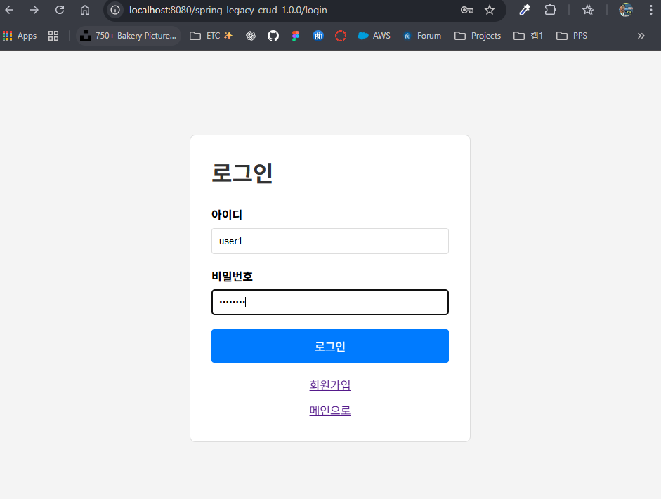
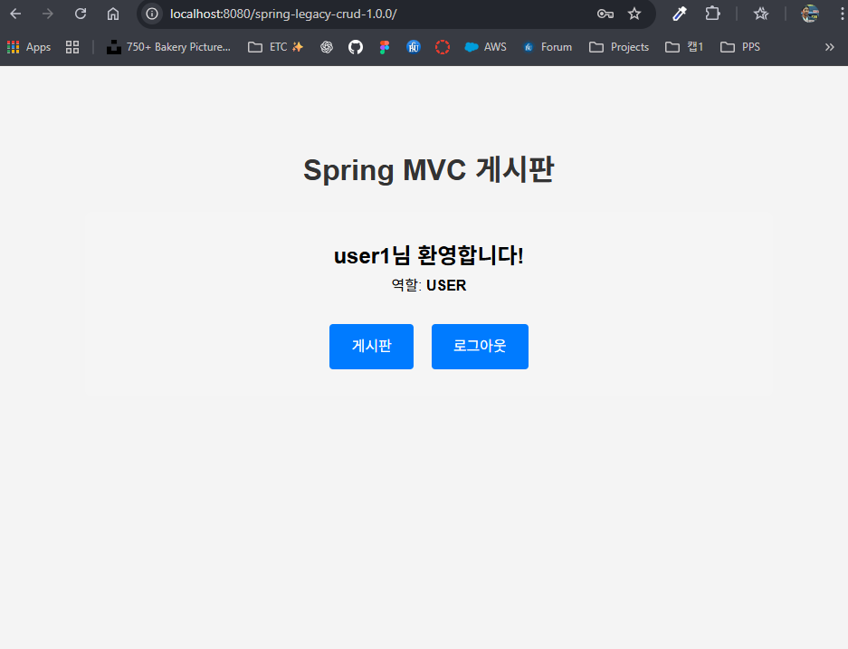
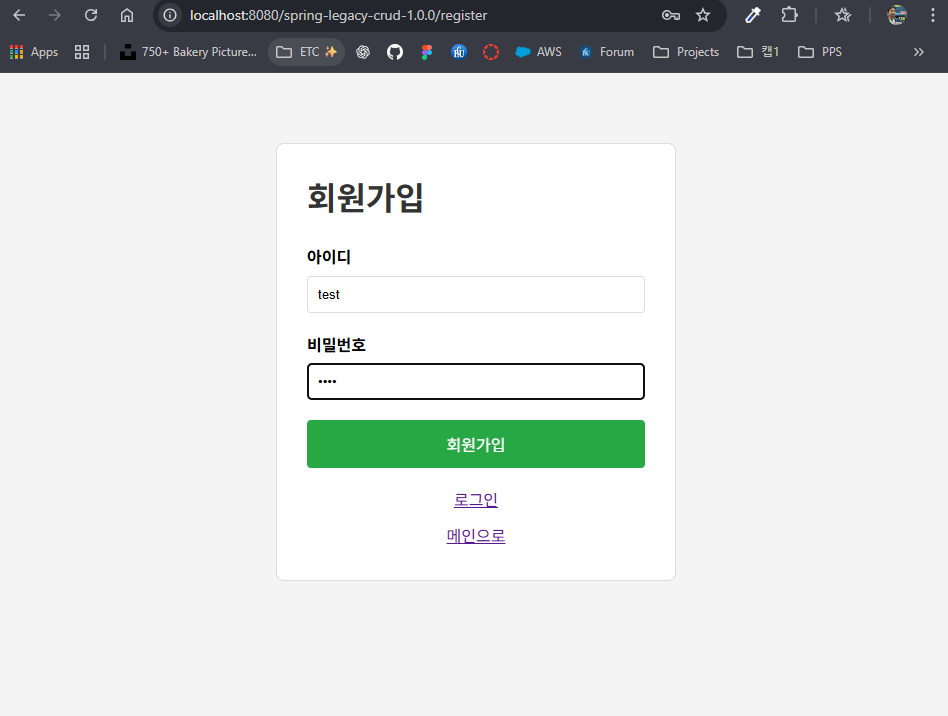
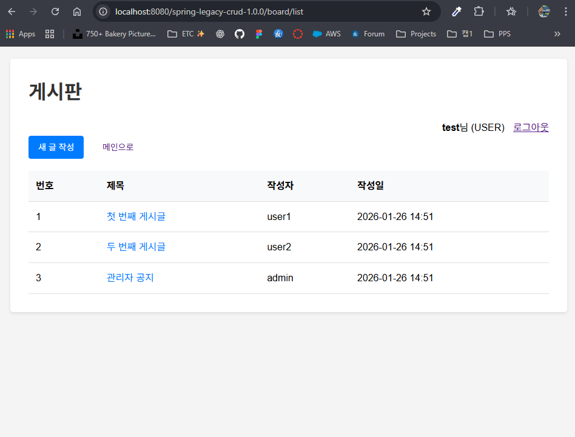
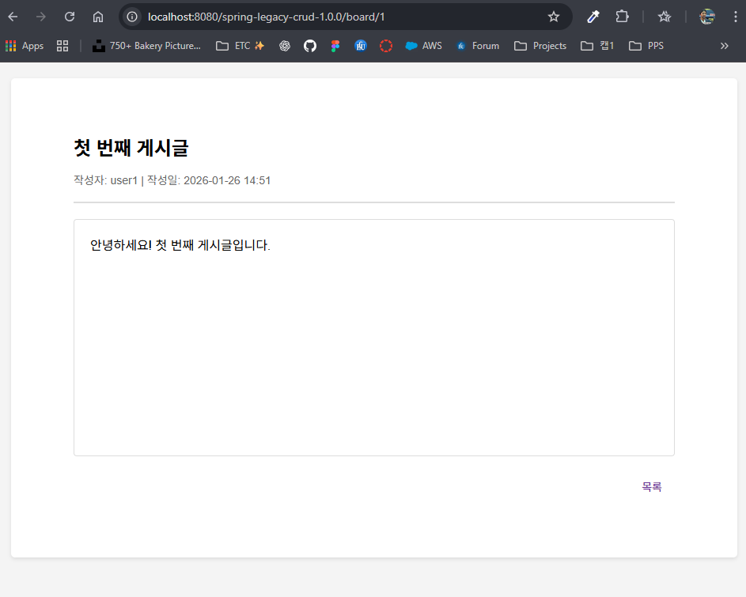
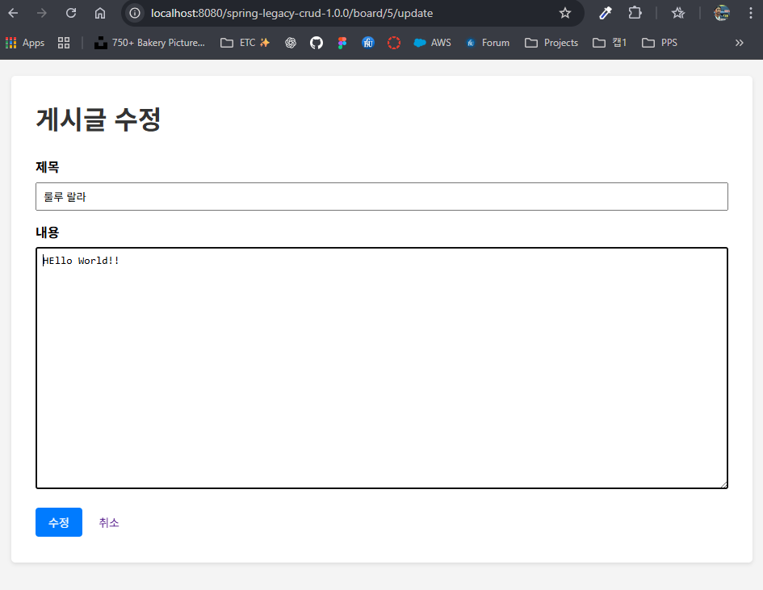

## 3주차 Spring MVC 게시판 + 로그인 프로젝트

### 1. 프로젝트 개요
- **기술 스택**: Spring MVC (XML 설정), MyBatis, MariaDB, JSP, Tomcat 9, Interceptor  
- **프로젝트 경로**: `week3`  
- **WAR 이름**: `spring-legacy-crud-1.0.0.war`  

---

### 2. 실행 환경 준비
- **JDK**: 8 이상 설치 및 `java -version` 확인  
- **Maven**: 설치 및 `mvn -version` 확인  
- **MariaDB**: 실행 중이어야 함 (`spring_board` DB 사용)  
- **Tomcat 9**: `C:\Users\User\apache-tomcat-9.0.107`  

#### 2-1. 데이터베이스 생성
MariaDB 접속:

```sql
CREATE DATABASE IF NOT EXISTS spring_board
  CHARACTER SET utf8mb4
  COLLATE utf8mb4_unicode_ci;

USE spring_board;

CREATE TABLE IF NOT EXISTS users (
  username VARCHAR(50) PRIMARY KEY,
  password VARCHAR(100) NOT NULL,
  role VARCHAR(10) DEFAULT 'USER',
  created_at TIMESTAMP DEFAULT CURRENT_TIMESTAMP
) ENGINE=InnoDB DEFAULT CHARSET=utf8mb4;

CREATE TABLE IF NOT EXISTS board (
  id INT AUTO_INCREMENT PRIMARY KEY,
  title VARCHAR(100) NOT NULL,
  content TEXT,
  writer VARCHAR(50) NOT NULL,
  created_at TIMESTAMP DEFAULT CURRENT_TIMESTAMP,
  updated_at TIMESTAMP DEFAULT CURRENT_TIMESTAMP ON UPDATE CURRENT_TIMESTAMP,
  FOREIGN KEY (writer) REFERENCES users(username) ON DELETE CASCADE
) ENGINE=InnoDB DEFAULT CHARSET=utf8mb4;

-- 테스트 데이터
INSERT INTO users (username, password, role) VALUES
('admin', 'password', 'ADMIN'),
('user1', 'password', 'USER'),
('user2', 'password', 'USER');

INSERT INTO board (title, content, writer) VALUES
('첫 번째 게시글', '안녕하세요! 첫 번째 게시글입니다.', 'user1'),
('두 번째 게시글', 'Spring MVC 게시판 프로젝트입니다.', 'user2'),
('관리자 공지', '관리자 공지사항입니다.', 'admin');
```

`root-context.xml` 안의 DB 계정/비밀번호가 실제 MariaDB 설정과 일치해야 한다.  

---

### 3. 빌드 & 배포

#### 3-1. Maven 빌드
프로젝트 루트에서:

```bash
cd week3
mvn clean package
```

성공 시 `target/spring-legacy-crud-1.0.0.war` 생성.  

#### 3-2. WAR 파일 Tomcat에 복사
PowerShell에서:

```powershell
cd "C:\Users\User\GitHub\WebCamp\web-camp-2026\week3"
Copy-Item -Force .\target\spring-legacy-crud-1.0.0.war "C:\Users\User\apache-tomcat-9.0.107\webapps\"
```

#### 3-3. Tomcat 실행

```powershell
cd "C:\Users\User\apache-tomcat-9.0.107\bin"
.\startup.bat
```

브라우저에서 다음 주소 접속:

```text
http://localhost:8080/spring-legacy-crud-1.0.0/
```

---

### 4. 주요 화면 설명

#### 4-1. 메인 페이지
- URL: `/`  
- 기능: 로그인 여부에 따라 다른 메뉴 표시  
- 화면 예시:

<br>

---

#### 4-2. 로그인
- URL: `/login`  
- 기능: 사용자 로그인 (세션에 `loginUser` 저장)  
- 테스트 계정: `admin` / `password` 또는 `user1` / `password`  
- 화면 예시:

<br>

---

#### 4-3. 회원가입
- URL: `/register`  
- 기능: 새 사용자 등록 (기본 role: USER)  
- 화면 예시:

<br>

---

#### 4-4. 게시판 목록
- URL: `/board/list`  
- 기능: 전체 게시글 리스트 조회 (로그인 필수)  
- Interceptor: 로그인하지 않은 사용자는 `/login`으로 리다이렉트  
- 화면 예시:

<br>

---

#### 4-5. 게시글 상세
- URL: `/board/{id}`  
- 기능: 게시글 상세 보기  
- 권한: 작성자 또는 ADMIN만 수정/삭제 가능  
- 화면 예시:

<br>

---

#### 4-6. 게시글 작성
- URL: `/board/create`  
- 기능: 새 게시글 작성 (작성자 = 로그인 사용자)  
- 화면 예시:

<br>

---

#### 4-7. 게시글 수정
- URL: `/board/{id}/update`  
- 기능: 게시글 수정 (작성자 또는 ADMIN만 가능)  
- 화면 예시:

<br>

---

### 5. Interceptor 동작

#### 5-1. 로그인 체크
- `/board/**` 경로 접근 시 `LoginInterceptor`가 로그인 여부 확인
- 로그인하지 않은 사용자는 자동으로 `/login`으로 리다이렉트

#### 5-2. 권한 체크
- 게시글 수정/삭제는 Controller에서 작성자 또는 ADMIN만 가능하도록 검증

---

### 6. 요청 흐름 (간단 정리)
- 브라우저 → `MainController` / `UserController` / `BoardController`  
- `LoginInterceptor` → 로그인 여부 확인 (`/board/**` 경로)  
- `Controller` → `Service` → `Mapper` → DB (`users`, `board` 테이블)  
- 결과 Model에 담아서 JSP(`main.jsp`, `login.jsp`, `register.jsp`, `board/*.jsp`) 렌더링
