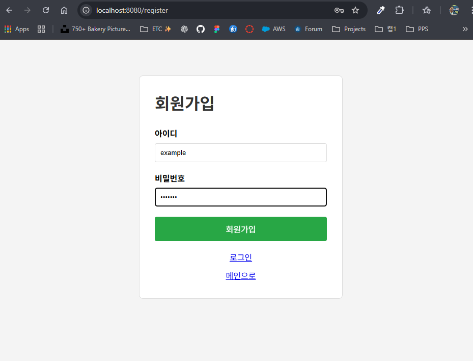
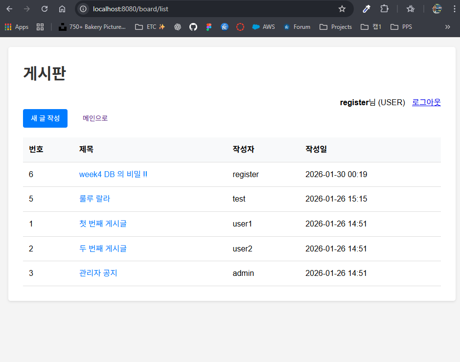
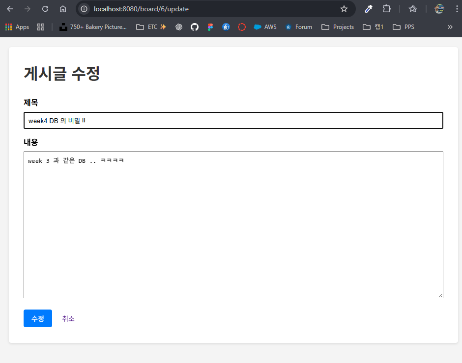

## 4주차 Spring Boot CRUD 프로젝트

### 1. 프로젝트 개요

- **기술 스택**: Spring Boot, JPA (또는 MyBatis), MariaDB, Thymeleaf/JSP, Embedded Server (Tomcat), Interceptor
- **프로젝트 경로**: `week4`
- **패키징**: JAR 파일 (Spring Boot embedded server 사용)
- **주요 차이점**: Week3(Spring MVC Legacy) → Week4(Spring Boot)

---

### 2. Week3 vs Week4 주요 차이점

| 항목 | Week3 (Spring MVC Legacy) | Week4 (Spring Boot) |
|------|---------------------------|---------------------|
| **프레임워크** | Spring MVC (XML 설정) | Spring Boot (자동 설정) |
| **설정 방식** | XML 기반 (`servlet-context.xml`, `root-context.xml`) | Java Config 또는 `application.properties` |
| **데이터 접근** | MyBatis | JPA/Hibernate (또는 MyBatis) |
| **배포 방식** | WAR → 외부 Tomcat | JAR → Embedded Tomcat |
| **의존성 관리** | 수동 버전 관리 | Spring Boot Starter (자동 버전 관리) |
| **실행 방식** | 외부 Tomcat 서버 필요 | `java -jar` 또는 IDE에서 직접 실행 |

---

### 3. 전체 흐름 및 핵심 개념

#### 3-1. 인증/인가 흐름

**회원가입**: 사용자를 DB에 저장(비밀번호 해시) → 성공 응답

**로그인**: 아이디/비밀번호 검증 → 인증 상태 부여
- **(선택) 세션 방식**: HttpSession에 로그인 정보 저장
- **(선택) JWT 방식**: 토큰 발급/검증

**로그아웃**: 인증 상태 제거
- 세션이면 `session.invalidate()`
- JWT면 "클라이언트 토큰 삭제 + (선택) 블랙리스트/리프레시 토큰 폐기"

**인가(접근 제어)**: 로그인한 사용자만 접근 가능한 URL을 막는 계층이 필요
- **Interceptor가 핵심 역할** (컨트롤러 들어가기 전 컷)

---

#### 3-2. Filter / Interceptor / AOP 개념 이해

##### Filter (Servlet Filter)
- **위치**: **DispatcherServlet(스프링 MVC 진입) 이전**
- **특징**: 서블릿 스펙, 스프링 밖에서도 동작
- **용도 예시**:
  - 인코딩, CORS, 요청/응답 로깅
  - XSS 방어, 공통 헤더 처리
  - **JWT라면** 토큰을 HTTP 레벨에서 먼저 파싱하는 구조도 가능 (보통 Spring Security로 감)

##### Interceptor (Spring MVC HandlerInterceptor)
- **위치**: **DispatcherServlet 이후, Controller 호출 전/후**
- **특징**: 스프링 MVC 흐름에 딱 맞음 (핸들러/컨트롤러 기준으로 전처리)
- **용도 예시** (이번 주제의 핵심):
  - "로그인했는지 확인해서 막기"
  - 권한(Role) 체크
  - 컨트롤러 공통 전처리 (사용자 정보 바인딩, 메뉴 권한 등)

##### AOP (Aspect-Oriented Programming)
- **위치**: **메서드 호출 단위 (프록시 기반)**
- **특징**: 웹 요청 흐름이 아니라 "비즈니스 로직 관심사 분리"에 강함
- **용도 예시**:
  - 트랜잭션, 성능 측정, 로깅
  - 감사(Audit), 예외 변환

---

#### 3-3. Interceptor로 회원 기능을 만들 때 필요한 핵심 토픽

##### 인증 상태 위치
- **세션 기반**: HttpSession에 `LOGIN_USER` 같은 키로 저장 (직관적임, 빠름)
- **JWT 기반**: Authorization 헤더의 토큰 (검증 로직 필요)

##### URL 접근 정책 (인가 정책) 설계
- **공개 URL**: `/`, `/login`, `/signup`, `/css/**`, `/js/**` ...
- **보호 URL**: `/mypage/**`, `/admin/**`, `/posts/write` ...
- Interceptor에서 `includePatterns` / `excludePatterns`로 관리

##### Interceptor 생명주기 이해
- **preHandle()**: 컨트롤러 호출 **전** (여기서 로그인 체크/리다이렉트)
- **postHandle()**: 컨트롤러 호출 **후**, 뷰 렌더링 전
- **afterCompletion()**: 요청 완료 후 (예외 포함), 리소스 정리/로그

##### 로그인 리다이렉트 UX (되게 중요)
- 로그인 안 한 상태에서 보호 URL 접근 → 로그인 페이지로 보내되,
- 원래 가려던 URL을 `redirectURL`로 저장해뒀다가 로그인 성공 후 복귀

##### 예외/에러 처리
- 인터셉터에서 차단할 때:
  - 401/403 상태코드로 응답할지
  - 로그인 페이지로 redirect할지 (웹 페이지냐 API냐에 따라 다름)
- REST API 방식이면 `ResponseEntity` + 상태코드 전략도 토픽 필요

---

### 4. 실행 환경 준비

- **JDK**: 8 이상 설치 및 `java -version` 확인
- **Maven**: 설치 및 `mvn -version` 확인
- **MariaDB**: 실행 중이어야 함 (`spring_board` DB 사용)

---

### 5. 빌드 & 실행 (Spring Boot 방식)

#### 5-1. Maven 빌드

프로젝트 루트에서:

```bash
cd week4
mvn clean package
```

성공 시 `target/spring-boot-crud-1.0.0.jar` 생성.

#### 5-2. JAR 파일 실행

```bash
java -jar target/spring-boot-crud-1.0.0.jar
```

또는 IDE에서 `@SpringBootApplication`이 있는 메인 클래스를 직접 실행.

브라우저에서 다음 주소 접속:

```text
http://localhost:8080/
```

**참고**: Spring Boot는 기본적으로 포트 8080에서 실행되며, `application.properties`에서 변경 가능합니다.

---

### 6. 주요 화면 설명

#### 6-1. 메인 페이지

- URL: `/`
- 기능: 로그인 여부에 따라 다른 메뉴 표시
- 화면 예시:

<br>

---

#### 6-2. 로그인

- URL: `/login`
- 기능: 사용자 로그인 (세션 또는 JWT 토큰 발급)
- **개선사항**: 원래 가려던 URL(`redirectURL`)로 자동 리다이렉트
- 테스트 계정: `admin` / `password` 또는 `user1` / `password`
- 성공시 화면 예시:

<br>

---

#### 6-3. 회원가입

- URL: `/register` 또는 `/signup`
- 기능: 새 사용자 등록 (비밀번호 해시 저장, 기본 role: USER)
- 화면 예시:

<br>

---

#### 6-4. 게시판 목록

- URL: `/board/list`
- 기능: 전체 게시글 리스트 조회 (로그인 필수)
- Interceptor: 로그인하지 않은 사용자는 `/login?redirectURL=/board/list`로 리다이렉트
- 화면 예시:

<br>

---

#### 6-5. 게시글 상세

- URL: `/board/{id}`
- 기능: 게시글 상세 보기
- 권한: 작성자 또는 ADMIN만 수정/삭제 가능
- 화면 예시:

<br>

---

#### 6-6. 게시글 작성

- URL: `/board/create`
- 기능: 새 게시글 작성 (작성자 = 로그인 사용자)
- 화면 예시:

<br>

---

#### 6-7. 게시글 수정

- URL: `/board/{id}/update`
- 기능: 게시글 수정 (작성자 또는 ADMIN만 가능)
- 화면 예시:

<br>

---

### 7. Interceptor 동작 (핵심)

#### 7-1. 로그인 체크

- `/board/**` 경로 접근 시 `LoginInterceptor`가 로그인 여부 확인
- 로그인하지 않은 사용자는 자동으로 `/login?redirectURL={원래URL}`로 리다이렉트
- 로그인 성공 후 `redirectURL`로 자동 복귀

#### 7-2. 권한 체크

- 게시글 수정/삭제는 Controller에서 작성자 또는 ADMIN만 가능하도록 검증
- 권한 없을 경우 403 Forbidden 또는 적절한 에러 페이지 표시

#### 7-3. URL 패턴 관리

```java
// 예시: WebMvcConfigurer를 구현한 설정 클래스
@Override
public void addInterceptors(InterceptorRegistry registry) {
    registry.addInterceptor(new LoginInterceptor())
        .addPathPatterns("/board/**", "/mypage/**", "/admin/**")
        .excludePathPatterns("/", "/login", "/signup", "/css/**", "/js/**", "/images/**");
}
```

---

### 8. 요청 흐름 (Spring Boot)

- 브라우저 → **Filter** (인코딩, CORS 등) → **DispatcherServlet** → **Interceptor** (로그인 체크) → **Controller** → **Service** → **Repository** (JPA) → DB
- 결과를 Model에 담아서 View (Thymeleaf/JSP) 렌더링

---

### 9. 참고 자료

#### 9-1. 튜토리얼 및 참고 프로젝트

- **Tutorial**: https://www.notion.so/1-Spring-Boot-CRUD-Operations-2253a9a638be80be9292fdc46c05fd1e#2ee3a9a638be80fcb7eef6a7a78ee628
- **완성 프로젝트**: https://github.com/jerry10004/sb_board-crud

#### 9-2. Spring 공식 사이트

1. **Spring 공식 포털**: https://spring.io
2. **Spring Boot 프로젝트 페이지**: https://spring.io/projects/spring-boot
3. **Spring Guides (공식 튜토리얼 모음)**: https://spring.io/guides
4. **Spring Initializr**: https://start.spring.io

#### 9-3. 핵심 가이드

- **Building a RESTful Web Service**: https://spring.io/guides/gs/rest-service/
- **Building an Application with Spring Boot**: https://spring.io/guides/gs/spring-boot/
- **Accessing Data with JPA**: https://spring.io/guides/gs/accessing-data-jpa/
  - Entity, JpaRepository, DB 연동 등 CRUD 구현의 핵심 개념
- **Validating Form Input**: https://spring.io/guides/gs/validating-form-input/
  - @Valid, @NotNull, @NotBlank 등 입력값 검증 흐름에 대한 이해

#### 9-4. 공식 문서

- **Spring Boot Reference Documentation**: https://docs.spring.io/spring-boot/docs/current/reference/html/
- **Spring Guides GitHub**: https://github.com/spring-guides

---

### 10. 연습 과정

1. 완성 프로젝트를 다운로드 받아서 실행해 보기
2. Tutorial을 참고하여 Spring Boot project 이해하기
3. Filter, Interceptor, AOP의 차이점과 사용 시나리오 이해하기
4. 세션 기반 인증 vs JWT 기반 인증 비교하기
5. 로그인 리다이렉트 UX 구현하기
6. REST API 방식의 에러 처리 (401/403) 구현하기
